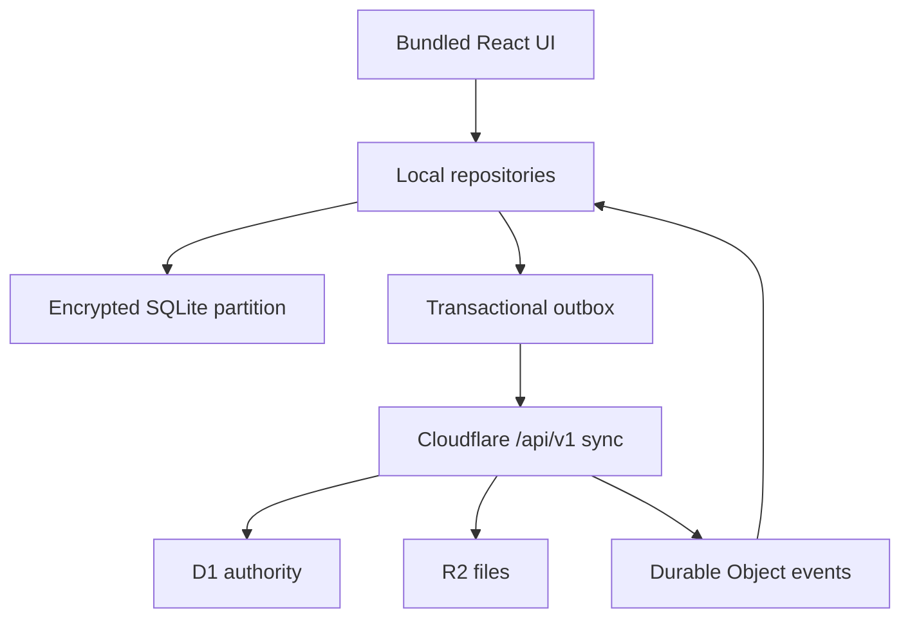

# Native local-first architecture

Status: accepted for implementation after Phase 13 review. Cloudflare remains the durable system of record; SQLite is the device read model and pending-write authority for one account partition.

## Decisions

### ADR-001 — bundled Capacitor React client

Android and iOS release builds contain the executable UI and deterministic empty, stale, offline and error states. Production `server.url` is removed only in Phase 14 after offline-start verification. Website and admin continue in Next.js. Content and data may update by sync; executable native UI and plugin changes require a signed store release.

### ADR-002 — SQLite device authority

Screens render from account-partitioned SQLite immediately, then synchronize. Reads never wait for refresh when a usable local record exists. A write updates the local projection and outbox in one transaction. The cursor advances only in the same transaction as every applied change. SQLite is not the global authority and is safe to rebuild from bootstrap plus deltas.

### ADR-003 — Cloudflare/D1 server authority

The mobile client accesses D1 and R2 only through authenticated, versioned Cloudflare APIs. D1 owns durable identity, academic data, entitlement, payment, moderation and conflict outcomes. R2 objects use short-lived authorized access. Existing identifiers are retained.

### ADR-004 — native bearer sessions

Website sessions remain HTTP-only cookies. Native login uses system-browser OAuth with PKCE, a one-use exchange code and a revocable bearer token stored only in Keystore/Keychain-backed storage. Token hashes and device metadata live in D1. Tokens never enter SQLite, URLs, analytics or logs.

### ADR-005 — change journal and transactional outbox

Each synchronizable domain exposes ordered, account-scoped changes and an opaque cursor. Pushes carry a stable idempotency key. Deletes are tombstones/change events. Domain conflict rules replace blanket last-write-wins: progress stages merge monotonically where valid; planner/notes use versions and explicit conflicts; timer sessions are immutable events; server authority wins for entitlement, moderation and academic catalogs.

### ADR-006 — typed community realtime events

Durable Objects publish typed events such as `message.created`, `message.updated`, `message.deleted`, `reaction.changed`, `read.changed`, `typing.changed`, and `presence.changed`. Durable events include channel sequence and entity version. The client commits the event into SQLite before updating the cursor. Gaps trigger delta recovery, not a full page refresh. Typing and presence are ephemeral and are not required for recovery.

## Package boundary

| Package | Browser | Capacitor/native | Next.js client | Next.js server / Cloudflare |
|---|---:|---:|---:|---:|
| `apps/web` | yes | no | yes | route-specific |
| `apps/mobile` | web runtime | yes | no | no |
| `packages/contracts` | yes | yes | yes | yes; pure schemas/types only |
| `packages/domain` | yes | yes | yes | yes; pure rules only |
| `packages/ui` | yes | yes | yes | no server imports |
| `packages/api-client` | yes | yes | yes | transports only; no bindings |
| `packages/mobile-data` | no | yes | no | no |
| `packages/sync-engine` | no | yes | no | no |
| `app/api`, `lib/data/d1`, workers | no | no | no | yes |

The automated boundary audit scans present and future mobile package roots. Missing future roots are allowed during Phase 13, while any created source file is immediately checked.

## Synchronization lifecycle

Cold start selects and unlocks the account partition, renders cached data, then runs capability check, outbox push and ordered pull. App resume repeats a bounded sync. Realtime events accelerate community updates but never replace the recoverable journal. Background execution is opportunistic; correctness cannot depend on the OS granting it.
